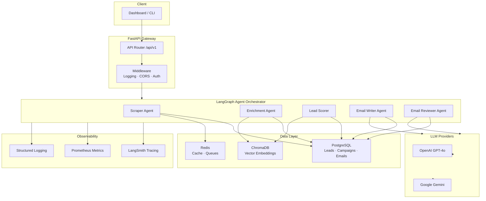

# 🎷 The Smooth Operator

[](https://github.com/your-org/smooth-operator/actions)
[](LICENSE)
[](https://www.python.org/downloads/)
[](https://github.com/astral-sh/ruff)

**AI-powered cold outreach engine** that researches leads, crafts hyper-personalized emails, and manages campaigns — all orchestrated by autonomous LLM agents.

---

## Architecture



---

## ✨ Features

| Category | Capabilities |
|---|---|
| **Lead Intelligence** | Web scraping, LinkedIn/GitHub enrichment, tech-stack detection, pain-point analysis |
| **Smart Scoring** | Hybrid vector search + BM25 retrieval, ML-based ICP scoring with reasoning |
| **Email Generation** | Multi-framework support (AIDA, PAS, BAB), Jinja2 templates, A/B variants |
| **Agent Orchestration** | LangGraph state machines, autonomous research → write → review pipeline |
| **Quality Assurance** | LLM-as-judge evaluation, hallucination detection, spam scoring, tone analysis |
| **Campaign Management** | Batch sends, follow-up sequences, open/click/reply tracking, daily limits |
| **Observability** | LangSmith tracing, Prometheus metrics, structured JSON logging, cost tracking |

---

## 🛠 Tech Stack

| Layer | Technology |
|---|---|
| **API Framework** | FastAPI + Uvicorn |
| **Database** | PostgreSQL 16 (async via asyncpg) |
| **ORM** | SQLAlchemy 2.0 (async) + Alembic |
| **Cache / Queue** | Redis 7 |
| **Vector Store** | ChromaDB |
| **LLM Orchestration** | LangChain + LangGraph |
| **LLM Providers** | OpenAI GPT-4o, Google Gemini |
| **Embeddings** | sentence-transformers (all-MiniLM-L6-v2) |
| **Retrieval** | Hybrid: dense vectors + BM25 |
| **Observability** | LangSmith, Prometheus, structlog |
| **Validation** | Pydantic v2 |
| **Evaluation** | DeepEval, RAGAS |

---

## 🚀 Quick Start

### Prerequisites

- Docker & Docker Compose
- Python 3.11+
- An OpenAI API key (or Google AI key)

### 1. Clone & Configure

```bash
git clone https://github.com/your-org/smooth-operator.git
cd smooth-operator
cp .env.example .env
# Edit .env with your API keys
```

### 2. Start Services

```bash
# Start PostgreSQL, Redis, ChromaDB
docker compose up -d

# Install dependencies
make dev

# Run migrations
make migrate

# Start the dev server
make serve
```

### 3. Open the API Docs

Navigate to [http://localhost:8000/docs](http://localhost:8000/docs) for the interactive Swagger UI.

---

## 📡 API Endpoints

| Method | Endpoint | Description |
|---|---|---|
| `GET` | `/health` | Basic health check |
| `GET` | `/health/ready` | Readiness probe (DB + Redis + Chroma) |
| `GET` | `/api/v1/leads` | List all leads (paginated) |
| `POST` | `/api/v1/leads` | Create a new lead |
| `GET` | `/api/v1/leads/{id}` | Get lead by ID |
| `PUT` | `/api/v1/leads/{id}` | Update a lead |
| `DELETE` | `/api/v1/leads/{id}` | Delete a lead |
| `POST` | `/api/v1/leads/scrape` | Trigger lead scraping |
| `POST` | `/api/v1/leads/enrich` | Trigger lead enrichment |
| `POST` | `/api/v1/leads/score` | Score leads against ICP |
| `GET` | `/api/v1/leads/search` | Semantic lead search |
| `POST` | `/api/v1/emails/generate` | Generate personalized email |
| `POST` | `/api/v1/emails/batch-generate` | Batch generate emails |
| `POST` | `/api/v1/emails/send` | Queue email for sending |
| `GET` | `/api/v1/emails/{id}/trace` | Get agent trace for email |
| `GET` | `/api/v1/campaigns` | List campaigns |
| `POST` | `/api/v1/campaigns` | Create campaign |
| `GET` | `/api/v1/campaigns/{id}` | Get campaign details |
| `PUT` | `/api/v1/campaigns/{id}` | Update campaign |
| `POST` | `/api/v1/campaigns/{id}/launch` | Launch a campaign |
| `GET` | `/api/v1/campaigns/{id}/analytics` | Campaign analytics |

---

## 📁 Project Structure

```
smooth-operator/
├── src/
│   ├── __init__.py
│   ├── config/
│   │   ├── __init__.py
│   │   └── settings.py          # Pydantic Settings v2
│   ├── db/
│   │   ├── __init__.py
│   │   ├── models.py            # SQLAlchemy 2.0 models
│   │   └── session.py           # Async engine & session
│   ├── api/
│   │   ├── __init__.py
│   │   ├── main.py              # FastAPI app & lifespan
│   │   ├── middleware/
│   │   │   ├── __init__.py
│   │   │   └── logging.py       # Structured request logging
│   │   ├── routes/
│   │   │   ├── __init__.py
│   │   │   ├── health.py
│   │   │   ├── leads.py
│   │   │   ├── emails.py
│   │   │   └── campaigns.py
│   │   └── schemas/
│   │       ├── __init__.py
│   │       └── models.py        # Pydantic request/response schemas
│   ├── agents/                  # LangGraph agent definitions
│   ├── services/                # Business logic layer
│   ├── evaluation/              # LLM evaluation pipeline
│   └── integrations/            # External API connectors
├── tests/
├── alembic/
├── data/
├── requirements/
│   ├── base.txt
│   ├── dev.txt
│   └── ml.txt
├── .env.example
├── .gitignore
├── docker-compose.yml
├── Makefile
├── pyproject.toml
└── README.md
```

---

## 🧑‍💻 Development

```bash
# Install dev dependencies
make dev

# Run tests with coverage
make test

# Lint & type-check
make lint

# Auto-format
make format

# Create a new migration
make migrate-new MSG="add_lead_tags_column"
```

---

## 🤝 Contributing

1. Fork the repository
2. Create your feature branch (`git checkout -b feature/amazing-feature`)
3. Write tests for your changes
4. Ensure all checks pass (`make lint && make test`)
5. Commit your changes (`git commit -m 'feat: add amazing feature'`)
6. Push to the branch (`git push origin feature/amazing-feature`)
7. Open a Pull Request

Please follow [Conventional Commits](https://www.conventionalcommits.org/) for commit messages.

---

## 📄 License

This project is licensed under the MIT License — see the [LICENSE](LICENSE) file for details.

---

<p align="center">
  Built with ☕ and 🎷 by the Smooth Operator team
</p>
