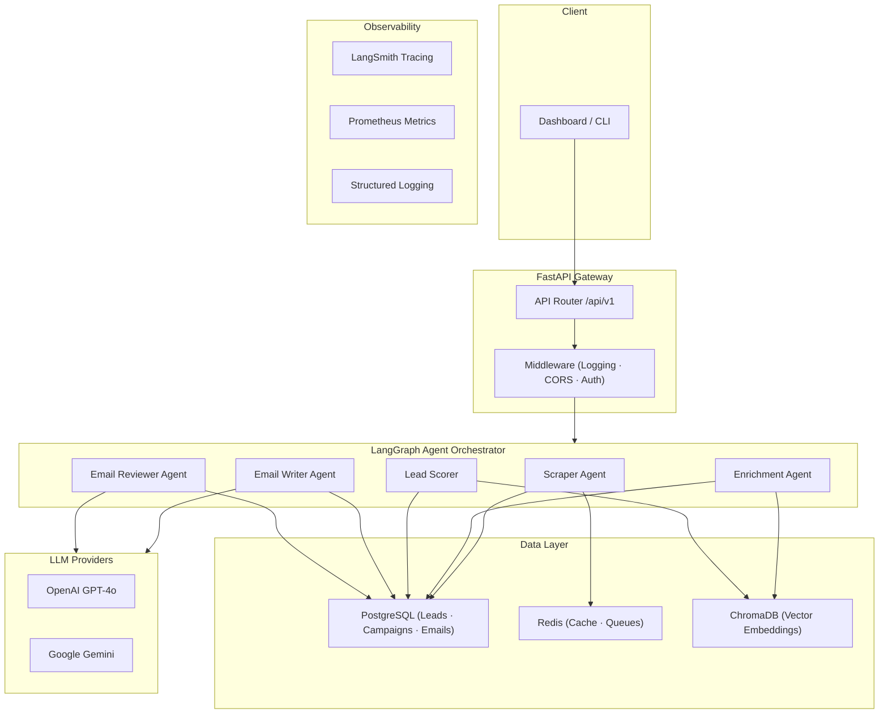

# System Architecture — The Smooth Operator

The Smooth Operator is a production-grade, AI-powered cold outreach engine designed for high-precision, personalized email generation and autonomous campaign execution.

## System Workflow

1. **Ingestion & Parsing**: Leads are ingested via the REST API or scraper workflows. Raw html, github, or linkedin profiles are processed and cleaned by format-specific parsers.
2. **Context Enrichment**: Enriched profile information is stored in PostgreSQL and synced to ChromaDB for semantic search capabilities.
3. **Lead Evaluation (Scoring)**: A LangGraph state machine scores leads on ICP alignment.
4. **Drafting & Generation**: Personalized emails are generated using specialized copywriting frameworks (AIDA, PAS, BAB).
5. **Quality & Guardrails**: Text outputs undergo PII detection, tone verification, and spam check compliance before queuing.
